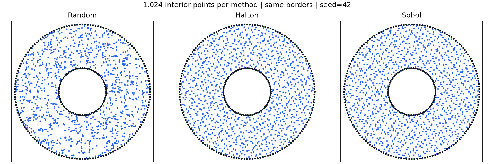

# RBFMeshGen

**2D point clouds from parametric boundaries.**

Random · Halton · Sobol &nbsp; | &nbsp; Python ≥ 3.9 &nbsp; | &nbsp; [MIT License](License.txt)

Define a domain, choose a sampler, and generate points with labeled boundaries—including holes, overlapping regions, and internal interfaces.



[Quick start](#quick-start) · [Sampling](#sampling) · [Examples](#examples) · [Development](#development)

## Quick start

Install the published release from [PyPI](https://pypi.org/project/RBFMeshGen/):

```bash
pip install RBFMeshGen
```

Random, Halton, and Sobol are included in the standard installation. For an
editable development installation, clone the repository and run:

```powershell
py -3.13 -m venv .venv
.\.venv\Scripts\Activate.ps1
python -m pip install -e .
```

Use any installed Python ≥ 3.9. On Linux/macOS, activate the environment with
`source .venv/bin/activate`.

Create a circular domain with a hole:

```python
import numpy as np
from RBFMeshGen import Border, RBFMesh, plot_mesh

outer = Border(lambda t: (np.cos(t), np.sin(t)),
               label="outer", t_start=0, t_end=2 * np.pi)
hole = Border(lambda t: (0.35 * np.cos(t), 0.35 * np.sin(t)),
              label="hole", t_start=0, t_end=2 * np.pi)

mesh = RBFMesh(outer(160), hole(-80))
mesh.generate_points(10000, method="halton", seed=42)
plot_mesh(mesh)
```

**160 outer + 80 hole boundary points, plus 10,000 interior points.**

## Sampling

| `method` | Sampler | Dependency |
| --- | --- | --- |
| `"random"` | Pseudorandom; default | Base install |
| `"halton"` | Scrambled Halton sequence | Standard install |
| `"sobol"` | Scrambled Sobol sequence | Standard install |

```python
mesh.generate_points(10000, method="sobol", seed=42, append=False)
```

- **Exact counts:** interior points are allocated by region area; boundary points are counted separately.
- **Repeatable results:** use the same `seed` and environment. Calls append by default; `append=False` replaces interior points and avoids duplicates when reusing a seed.
- **Preserved boundaries:** switching samplers keeps border counts and labels, including internal interfaces. Samples removed by holes are excluded.

These methods generate point clouds without enforcing minimum spacing. Clipping Sobol to a domain does not preserve its full power-of-two balance properties. See the SciPy docs for [Halton](https://docs.scipy.org/doc/scipy/reference/generated/scipy.stats.qmc.Halton.html) and [Sobol](https://docs.scipy.org/doc/scipy/reference/generated/scipy.stats.qmc.Sobol.html).

## Boundaries & data

`border(n)` sets `abs(n)` segments; a negative count reverses traversal. **Counterclockwise contours add regions; clockwise contours define holes.** Contours must close within `abs_tol` (default `1e-4`). Invalid or undersampled contours raise `ValueError`.

| Attribute | Contents |
| --- | --- |
| `mesh.Points` | Interior points |
| `mesh.Boundary_Points` | External and internal boundary points |
| `mesh.region_polygons` | Disjoint Shapely regions |

Each point exposes `x`, `y`, `label`, and `is_border`. Set `Border(..., is_border=False)` to exclude its samples from `Boundary_Points`.

## Examples

```powershell
python .\examples\example_6_sampling.py
```

| Example | Domain |
| --- | --- |
| [01 · Annulus](examples/example_1.py) | Circular boundary with a central hole |
| [02 · Connected borders](examples/example_2.py) | Straight edges and shared interfaces |
| [03 · Airfoil](examples/example_3.py) | Circular domain around an airfoil |
| [04 · Overlapping circles](examples/example_4.py) | Intersecting regions |
| [05 · Concentric circles](examples/example_5.py) | Internal interface and central hole |
| [06 · Sampling comparison](examples/example_6_sampling.py) | Random, Halton, and Sobol side by side |

Replace the filename to run another example. Close its Matplotlib window to finish.

## Development

The package has three core modules: [geometry](RBFMeshGen/geometry_utils.py), [generation](RBFMeshGen/mesh_generation.py), and [visualization](RBFMeshGen/visualization_tools.py).

Run the test suite from an activated development environment:

```powershell
python -m unittest discover -s tests -v
```

**Publishing:** [GitHub Actions](.github/workflows/python-publish.yml) builds and
uploads to PyPI when a `v*` tag is pushed. Update the version in `setup.py` and
`.bumpversion.cfg` before tagging a new release.

RBFMeshGen generates point clouds; it does not currently implement RBF interpolation or element connectivity. Contributions are welcome under the [MIT License](License.txt).
