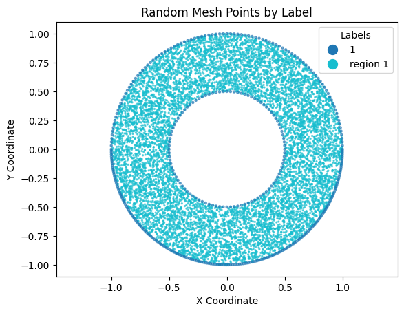

# RBFMeshGen

RBFMeshGen generates and visualizes random 2D point clouds within parametric geometric boundaries. It uses Shapely for region operations and rejection sampling for interior points. It does not currently implement RBF interpolation or mesh connectivity.

## Features

- **Geometric Boundary Definitions**: Define complex boundaries using parametric functions.
- **Mesh Generation**: Generate meshes based on defined geometric borders, ensuring points adhere to specified orientations and distributions.
- **Visualization Tools**: Visualize meshes and geometric borders, supporting both individual and collective plot displays.
- **Utility Functions**: Includes utility functions to calculate mesh orientations and handle geometric calculations.

## Installation

Requires Python 3.9+, NumPy, Matplotlib 3.6+, and Shapely 2.0+.
From the cloned repository directory, install the local code in editable mode.
On Windows PowerShell:

```powershell
py -3.13 -m venv .venv
.\.venv\Scripts\python.exe -m pip install -e .
.\.venv\Scripts\python.exe .\examples\example_1.py
```

If `.venv` already exists, skip its creation. Python 3.13 is an example of a
supported interpreter; select an installed compatible version if needed.
On Linux/macOS, use `python3 -m venv .venv` and `.venv/bin/python` instead.

## Project structure and examples

- `RBFMeshGen/geometry_utils.py`: points, parametric borders, and closed contour discovery.
- `RBFMeshGen/mesh_generation.py`: region processing and random interior points.
- `RBFMeshGen/visualization_tools.py`: Matplotlib plots.
- `RBFMeshGen/__init__.py`: public imports.
- `examples/example_1.py`: circular annulus.
- `examples/example_2.py`: connected straight borders.
- `examples/example_3.py`: circular domain with an airfoil-shaped hole.
- `examples/example_4.py`: overlapping circles.
- `examples/example_5.py`: nested circles with positive orientation, not holes.

Run any example by substituting its filename in the command above. Each opens
a Matplotlib figure. Close the figure to finish the script.

## Usage

```python
import numpy as np
from RBFMeshGen import RBFMesh, plot_mesh, Border


# Define a parametric function for a circle
def circle_parametric_function(radius, t):
    return radius * np.cos(t), radius * np.sin(t)


# Define the borders of the mesh
outer_radius = 1.0
inner_radius = 0.5

border_outer1 = Border(parametric_function=lambda t: circle_parametric_function(outer_radius, t), label=1, t_start=0,
                       t_end=np.pi)
border_outer2 = Border(parametric_function=lambda t: circle_parametric_function(outer_radius, t), label=1,
                       t_start=np.pi, t_end=2 * np.pi)
border_inner1 = Border(parametric_function=lambda t: circle_parametric_function(inner_radius, t), label=1, t_start=0,
                       t_end=2 * np.pi)

# Generate a random mesh
random_mesh = RBFMesh(border_outer1(100), border_outer2(200), border_inner1(-100))

# Generate points
num_points = 10000
random_mesh.generate_points(num_points)

# Plot the points
plot_mesh(random_mesh)
```



`Border(n)` uses `abs(n)` segments; a negative value reverses traversal.
Counterclockwise closed contours define regions, and clockwise contours define holes.
`mesh.Points` holds interior points; `mesh.Boundary_Points` holds points on
external boundaries and internal interfaces between regions. A border marked
`is_border=False` does not contribute to `Boundary_Points`. Samples in areas
removed by holes are excluded.
Each point has `x`, `y`, `label`, and `is_border` attributes.

`generate_points(n)` adds exactly `n` interior points, allocated by region area.
Repeated calls append by default for compatibility. Use
`mesh.generate_points(n, append=False)` to replace existing interior points.
The count excludes boundary points. Set `random.seed(42)` before generation
(after `import random`) for reproducible sampling.
Invalid counts and a `boundary_distance` that eliminates a requested sampling
region raise `ValueError` without replacing existing points.

## Geometry validation and regions

Borders must form directed closed contours. Their endpoints must match within
`abs_tol` (default `1e-4`), which must be finite and positive. Open borders,
incorrectly directed connections, non-finite coordinates, self-intersections,
and zero-area contours raise `ValueError` instead of being silently ignored or
repaired. Set each border's segment count with `border(n)` before constructing
a mesh: `n` must be a non-zero integer, and each complete contour needs at least
three distinct sampled points. Curves are validated at their sampled resolution.

Shared borders are supported. At a junction, contour discovery chooses a shortest
directed closing path in number of borders for each border, with input order
breaking ties. For complex junctions, define separate closed contours when you
need to specify the intended grouping explicitly.

Nested and overlapping positive contours are partitioned into valid Polygon
regions with no overlapping area. Edge and point contacts do not become regions.
Three concentric positive contours produce three regions (two annuli and a disk).
Their internal circular interfaces retain their requested border samples:
for example, `Circle2(10000)` preserves 10,000 points on that interface when
it remains entirely in the domain, including its original label.
Clockwise contours are subtracted from every region, including when a hole
completely removes a region. A cut that splits a region produces separate
Polygon components. Region numbering can differ from previous releases.

An empty resulting domain has no boundary points. Generating zero points is
allowed; requesting a positive count raises `ValueError`.

Run regression tests from the repository root:

```powershell
.\.venv\Scripts\python.exe -m unittest discover -s tests -v
```

## Contributing

Contributions to RBFMeshGen are welcome! Please feel free to fork the repository, make changes, and submit pull requests. You can also open issues to discuss potential changes or report bugs.

## License
RBFMeshGen is released under the MIT License. See [License.txt](License.txt) for full details.


